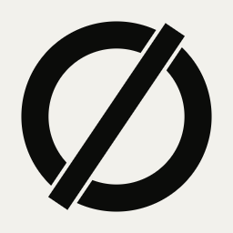

<p align="center">
  <a href="https://gorbital.dev">
    <picture>
      <source media="(prefers-color-scheme: dark)" srcset="docs/brand/logo/png/mark-acid-on-ink-256.png">
      
    </picture>
  </a>
</p>

<h1 align="center">gorbital</h1>

<p align="center"><strong>Go APIs, ready for orbit.</strong></p>

<p align="center">
  <a href="https://pkg.go.dev/gorbital.dev"></a>
  <a href="https://github.com/gorbital/gorbital/releases"></a>
  <a href="LICENSE"></a>
</p>

<p align="center">
  <a href="https://gorbital.dev">Website</a> ·
  <a href="https://docs.gorbital.dev">Documentation</a> ·
  <a href="https://docs.gorbital.dev/quickstart/">Quickstart</a> ·
  <a href="CHANGELOG.md">Changelog</a> ·
  <a href="docs/roadmap.md">Roadmap</a>
</p>

---

gorbital is a Go library and a CLI, `orb`, that write a production API into your repository: PostgreSQL, sign-in with 2FA and passkeys, API keys, organisations, background jobs, email, feature flags, audit logs, observability and ops endpoints. The code it writes is plain Go that you read, change and own. Sign-in and organisations are written into your repository too, so you can read how every flow works; the primitives they call, such as password hashing, session tokens and OAuth verification, stay in the library, so fixes to those reach you with `go get`.

Your app keeps building if you uninstall `orb`.

## Status

**`v0.3.2` is the current release**, published on 2026-09-22. `v0.1.0` was the first public one; everything in the
[roadmap](docs/roadmap.md) marked done is in the current release, and every change is in the
[changelog](CHANGELOG.md). **Do not use `v0.3.0`:** it is retracted and does not build outside this repository, and
`go get` says so. `v0.3.2` is the same code as `v0.3.1` with every module requiring the version it ships with.

v0 carries no compatibility promise: a minor release may change the API, and when it does, the [changelog](CHANGELOG.md) and [upgrade notes](docs/guides/upgrade-notes.md) say what to do. The compatibility checks already run on every change. `v1.0.0` freezes the API and starts the scaffold compatibility promise, and it ships only after the external security review signs off ([stability](docs/guides/stability.md)).

## Install

You need Go 1.26 or later and Docker.

```bash
go install gorbital.dev/cli/cmd/orb@latest
```

`orb` goes into `$(go env GOPATH)/bin`. If your shell says `command not found: orb`, add that directory to your `PATH` and open a new terminal.

To use the library without the CLI:

```bash
go get gorbital.dev@latest
```

## Quickstart

```bash
orb new my-api --preset full --scope single
cd my-api
orb dev
```

`orb dev` starts PostgreSQL and a mail catcher in Docker, runs migrations and seed data, then starts your API and the Dev Portal. It prints the seeded administrator's password and 2FA key once. In a terminal, `orb new` starts `orb dev` for you.

| Open | What |
|---|---|
| http://localhost:8080/docs | Your API's reference, with "Try it" |
| http://127.0.0.1:3100 | The Dev Portal: requests, logs, email, jobs, database and configuration |
| http://127.0.0.1:8025 | Mailpit: every email sent in development |

The [Quickstart](docs/start/quickstart.md) walks through it with the real output. If something goes wrong, see [Troubleshooting](docs/start/troubleshooting.md).

## What it decided for you

- **Plain Go.** Standard `net/http` and `log/slog`, constructors instead of a DI container, no reflection wiring. You give up the conveniences of a heavier framework.
- **PostgreSQL only.** Jobs, sessions, rate limits, settings and audit logs live there too. There's no Redis, Kafka or SaaS to run. No MySQL, no SQLite: if that rules you out, it rules you out.
- **You own the code.** A layered structure with one folder per domain module. `orb upgrade` merges template changes on a branch and never overwrites your edits silently. You also maintain what's generated.
- **Three layers, and only the first is ours.** Argon2id passwords, session tokens, OAuth, TOTP and passkeys are versioned library packages, and no command moves them into your app: that is the one place a small change is a security hole you cannot see. The sign-in and organisation *flows* are written into `internal/modules/auth` and `internal/modules/orgs`, where you read and change them. What a role means, what a tenant is and who may do what are yours alone, and are not in the library at all. `orb doctor --security` tells you when a flow you own has a fix waiting upstream.
- **Your tenant, your word.** Tenancy is a contract you fill in — its name, its path parameter, its ID format, its roles — so your API says `/v1/merchants/{merchantId}/orders` and refuses with `merchant_not_found`. The framework never learns your table names and never queries them. Organisations are the implementation we supply, not the model you inherit.
- **Operations from day one.** Health and readiness checks, OpenTelemetry, Prometheus metrics, runtime settings, feature flags, maintenance mode, incidents and an ops API guarded by roles and 2FA.

## Presets

```bash
orb new shop-api    --auth basic --scope merchant     # password sign-in, merchants own the data
orb new catalog-api --auth none  --scope none         # a public API: no users, no auth tables
orb new club-api    --auth basic --scope custom       # your own membership rules from commit one
orb new saas-api    --auth full  --scope organisation # everything
```

| Preset | What you get |
|---|---|
| **Minimal** | HTTP server, configuration, structured logs, tracing, health checks, security headers, OpenAPI docs, development-only dev console APIs. No database. |
| **Full** | Everything in Minimal, plus PostgreSQL, background jobs, email through Resend or SMTP, roles and permissions, runtime settings, feature flags, idempotency keys, file storage, audit logs, live observability and incidents, and the ops API. |

`--auth` decides how much sign-in a Full app gets: `none` (no users, no auth tables), `basic` (email and password, sessions, operators — 29 endpoints) or `full` (and 2FA, passkeys, Google, Apple, GitHub, API keys and service accounts — 74).

`--scope` decides what owns the data: `none`, `single` (users), `custom` (your tables and your rules), or a name of your own, which mounts organisations under that word with members, invitations and optional row-level security.

## Modules

The root module holds the small core. Everything that brings a dependency is its own module, so your app only downloads what it uses. All modules share one version.

| Import path | What it does |
|---|---|
| `gorbital.dev` | Core: `httpx`, `config`, `health`, `actor`, `audit`, `mail`, `page`, `ratelimit`, `requestid`, `buildinfo`, `app` |
| `gorbital.dev/modules/postgres` | pgx pool with tracing, transactions, migrations, row-level security context |
| `gorbital.dev/modules/auth` | Passwords, sessions, one-time codes, 2FA, passkeys, social sign-in, API keys |
| `gorbital.dev/modules/orgs` | Organisations, memberships and invitations for multi-tenant apps |
| `gorbital.dev/modules/jobs` | Background jobs on PostgreSQL with River |
| `gorbital.dev/modules/settings` | Runtime settings with defaults, bounds and per-organisation overrides |
| `gorbital.dev/modules/flags` | Feature flags with targeting and percentage rollouts |
| `gorbital.dev/modules/auditpg` | Audit events stored and queried in PostgreSQL |
| `gorbital.dev/modules/idempotency` | Safe retries of POST and PATCH with `Idempotency-Key` |
| `gorbital.dev/modules/ratelimitpg` | Rate limits shared across instances |
| `gorbital.dev/modules/observability` | Request, error and latency windows across instances, and incidents |
| `gorbital.dev/modules/releases` | Which build every instance runs |
| `gorbital.dev/modules/storage` | File storage on local disk or S3-compatible buckets, plus the log archive |
| `gorbital.dev/modules/telemetry` | OpenTelemetry tracing and metrics, logs correlated with traces, Prometheus |
| `gorbital.dev/modules/openapi` | Huma on the standard `http.ServeMux`, problem+json errors, API docs |
| `gorbital.dev/modules/devconsole` | Development-only `/_dev` APIs for the Dev Portal |
| `gorbital.dev/modules/jwt` | Tokens from an external identity provider (Auth0, Clerk, Supabase, Firebase, Cognito) verified against its JWKS |
| `gorbital.dev/modules/mail/resend` | Email through Resend, with bounce and complaint webhooks |
| `gorbital.dev/modules/mail/smtp` | Email through any SMTP server |
| `gorbital.dev/modules/mail/suppressionpg` | The email suppression list in PostgreSQL |
| `gorbital.dev/cli` | The `orb` command |

API reference for every package: [pkg.go.dev/gorbital.dev](https://pkg.go.dev/gorbital.dev).

## Documentation

- **Start:** [What you need](docs/start/prerequisites.md), [Quickstart](docs/start/quickstart.md), [Your first resource](docs/start/first-resource.md), [Concepts](docs/start/concepts.md)
- **Build a whole app:** [Build an app](docs/build/00-what-were-building.md), twenty-three chapters that write Plateful, a restaurant platform, from `orb new` to deployment
- **Sign-in:** [Overview](docs/sign-in/overview.md), [Every key and credential](docs/sign-in/all-keys.md)
- **Own your model:** [Tenancy](docs/guides/tenancy.md), [Access control](docs/guides/access-control.md), [Resource access](docs/guides/resource-access.md), [The code in your repo](docs/guides/the-code-in-your-repo.md)
- **Build and run:** [Architecture](docs/architecture.md), [Life of a request](docs/guides/request-lifecycle.md), [Environment variables](docs/guides/environment-variables.md), [Testing](docs/guides/testing.md), [Running in production](docs/guides/production.md)
- **Keep up to date:** [Upgrading](docs/start/upgrading.md), [Upgrade notes](docs/guides/upgrade-notes.md), [Stability](docs/guides/stability.md)
- **Why it's built this way:** [Decision records](docs/adr/README.md), [Roadmap](docs/roadmap.md)

Everything is also at [docs.gorbital.dev](https://docs.gorbital.dev). The full index is [docs/README.md](docs/README.md).

## Contributing

Read [CONTRIBUTING.md](CONTRIBUTING.md) before opening a pull request. Larger changes start with a decision record. [GOVERNANCE.md](GOVERNANCE.md) explains who decides, and the [Code of Conduct](CODE_OF_CONDUCT.md) applies everywhere.

## Security

Don't report vulnerabilities in public issues. [SECURITY.md](SECURITY.md) says how to report them privately and which versions get fixes. The [threat model](docs/adr/0029-threat-model.md) and [internal security review](docs/security/2026-09-internal-review.md) are public.

## License

gorbital is licensed under the [Apache License 2.0](LICENSE). See [NOTICE](NOTICE).

gorbital is provided "as is", without warranty of any kind, express or implied, including the warranties of merchantability, fitness for a particular purpose and non-infringement. You are responsible for deciding whether it suits your use, including production, security-sensitive and regulated workloads. In no event shall the authors, contributors or copyright holders be liable for any claim, damages or other liability arising from the software or its use. The License's Sections 7 and 8 govern.
