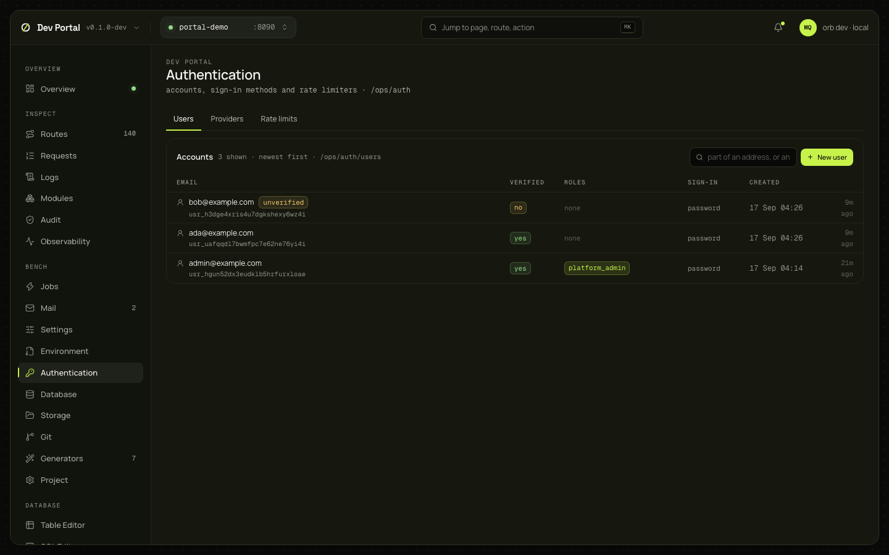

# Authentication

The app's accounts as an operator sees them: search and paging, one account's sessions, passkeys, linked providers, second factors and pending codes, with every operator action; the sign-in methods; and the rate limiters. Reads `/ops/`, so a Full app with the `auth` feature.

## What you see

Three tabs (`?tab=users|providers|rate-limits`); the open account is `?user=`.

| Tab | What it shows |
|---|---|
| Users | Search by part of an address; the accounts newest first: email and ID with badges such as `unverified`, verified, roles, sign-in method, created; Load more by cursor; New user |
| An account | The profile and its actions; roles (granted from the app's permission catalogs, revoked from chips); sessions; passkeys; linked providers; second factors; pending verification and reset codes with their purpose, attempts and expiry, and a link to Mail, where the code is |
| Providers | A card per sign-in method: enabled with its detail, or the `.env` lines that turn it on and the guide section |
| Rate limits | The limiters (name, what the key is, the limits) and a reset form: limiter and key |

## What you can do

| Action | Endpoint | Confirmation |
|---|---|---|
| Create a user | `POST /ops/auth/users` (email, password, verified or not); `email_taken`, `invalid_email` and `weak_password` land under the field | No |
| Verify the address | `POST …/verify-email` | No |
| Ban, unban | `POST …/ban` with a reason, `…/unban`. A ban revokes every session and API key and refuses every sign-in method | Ban asks for the reason |
| Grant, revoke a role | `POST …/roles`, `DELETE …/roles/{role}` | No |
| End one session, end all | `DELETE …/sessions/{id}`, `DELETE …/sessions` | No |
| Remove a passkey, unlink a provider | `DELETE …/passkeys/{id}`, `DELETE …/identities/{id}` | No |
| Enroll a second factor, reset MFA | `POST …/mfa/enroll` shows the secret and the recovery codes once; `…/mfa/reset` | No |
| Act as user | `POST …/impersonate` answers a session token once: Copy, or "Use in Routes", which opens the [request builder](routes.md) with it | No |
| Delete | `DELETE /ops/auth/users/{id}`: the owner's deletion without the password (hooks, identities unlinked, keys and sessions revoked) | A typed confirmation |
| Reset a rate limit | `POST /ops/auth/rate-limits/reset` with the limiter and the key; the toast says whether a budget existed | No |

Every action is audited (`auth.user.banned`, `auth.session.revoked_by_operator`, `auth.user.impersonated`, `ops.rate_limit.reset`…) with the dev operator as actor.

## Where it comes from

`/ops/auth/users…`, `/ops/auth/providers`, `/ops/auth/rate-limits` ([ops API](../guides/ops-api.md#accounts)); the permission catalogs from `/_dev/app`; the inbox for codes. Decided in [ADR-0070](../adr/0070-operators-account-apis.md); the [authentication guide](../guides/authentication.md#operating-accounts) and the [sign-in guides](../sign-in/overview.md) cover the rest.

## Notes

- Codes are stored hashed, so the API says a usable code exists and the [Mail](mail.md) screen shows it.
- Impersonation exists only while the app runs with the dev console; elsewhere it answers 403 `impersonation_off`. Production never has it.
- A ban revokes API keys, which stay revoked after an unban; the person creates new ones.
- Providers are configured in `.env` (through [Environment](environment.md)), never in the database.
- The role select needs the console for the catalogs; without it, the role is a text field.
