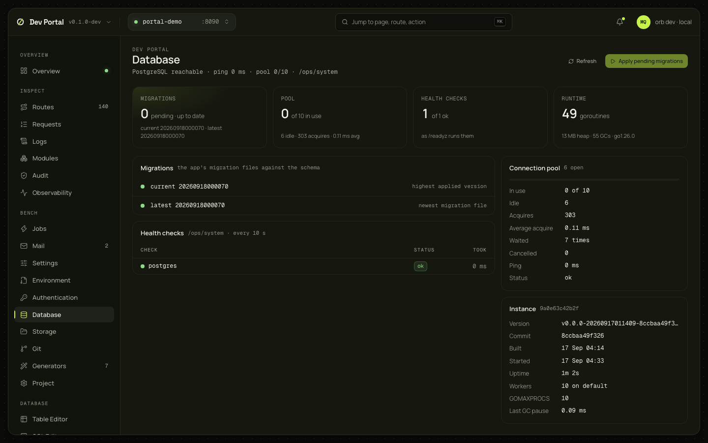

# Database

The Database overview: the migration state, the pool and the health checks, and a button that applies pending migrations without restarting the app. The other database screens have their own pages: [Table Editor](table-editor.md), [SQL Editor](sql-editor.md), [Schema, Objects and Migrations](schema-objects-migrations.md). Needs an app with a database (`DATABASE_URL` in `.env`); a Minimal app shows that it has none.

## What you see

| Panel | What it shows |
|---|---|
| Header | Whether PostgreSQL is reachable, the ping, the pool in use |
| Migrations | The pending count (also the sidebar's badge), the current version and the latest file, from the app's own view of `db/migrations` |
| Schema status banner | From the live schema status ([ADR-0080](../adr/0080-live-schema-status.md)): files pending with why they wait (`orb dev --no-reload`, the app stopped or failed, a failed migrate with its error) and a Restart button, files edited after they were applied with a Redo button, out-of-order files; refreshed by every `schema` event, so a file saved in the editor shows within the watch interval |
| Pool | In use, idle, acquires, average acquire time, waits, cancellations, ping, status, from `/ops/system` |
| Health checks | The readiness checks as `/readyz` runs them, every 10 s |
| Runtime and instance | Goroutines, heap, GC count and pauses, Go version; the instance's version, commit, build and start time, uptime, workers, `GOMAXPROCS` |

## What you can do

| Action | What it does |
|---|---|
| Apply pending migrations | `POST /_portal/api/app/migrate`: `orb dev` runs `go run ./cmd/migrate` through the supervisor, without a restart. 202, then the outcome arrives on the Overview's stream; 409 in an app without a database. It changes the database, not the files |

No confirmation: applying a file that is already in `db/migrations` is what `orb dev` does on every file change anyway.

## Where it comes from

`GET /_portal/app/_dev/migrations` ([dev console](../guides/dev-console.md)), `/_portal/app/ops/system`, `POST /_portal/api/app/migrate` ([ADR-0066](../adr/0066-dev-portal.md)); the banner from `GET /_portal/api/db/schema-status` and the `schema` event ([ADR-0080](../adr/0080-live-schema-status.md), [guide](../guides/dev-portal.md#schema-changes-from-code)).

## Notes

- Table sizes and slow queries are on [Observability](observability.md)'s Database and Queries tabs.
- The migration files with their SQL, roll back and redo are on [Migrations](schema-objects-migrations.md#migrations).
