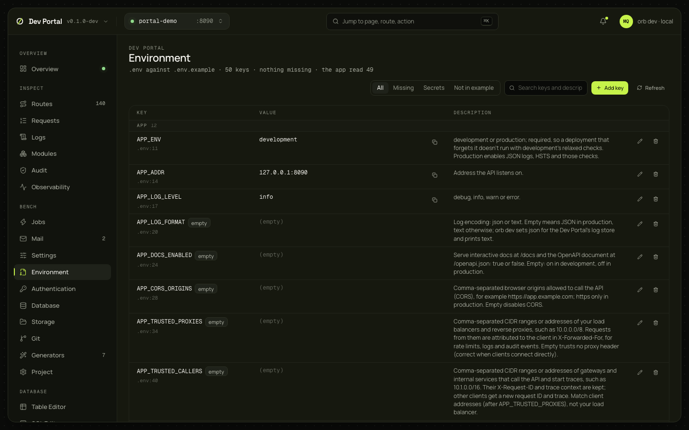

# Environment

`.env` against `.env.example`: every key with its description, secrets hidden until revealed, missing keys flagged, and editing in place. `orb dev` owns the file. The app reads it when it starts, so every change offers a restart.

## What you see

| Part | What it shows |
|---|---|
| Filters | All, Missing (with the count), Secrets, Not in example; search (`?q=`) |
| Header | The key count, how many are missing, and how many the running app read |
| The table, grouped by prefix (`APP`, `AUTH`, `GOOGLE`…) | Key with its line in `.env`, value (masked for secrets, with Copy), the description from the comment block above the key in `.env.example`, the example value, badges, and Edit and Delete |
| Badges | `missing from .env` (in the example, not in the file), `not in .env.example`, `secret`, `empty`, `not read by the app` (the running app didn't read it, from `/_dev/config`; only while the console answers) |
| Banner | After a change: "The app reads .env when it starts", with Restart the app; under it the last build or start failure, which names a refused variable, with a link to the Overview |

## What you can do

| Action | What it does | Confirmation |
|---|---|---|
| Reveal, Hide, Copy | Fetches a secret's value (never cached; it stays in the page until Hide or the next save) | No |
| Edit (the pencil), Set a value, Use the example | Rewrites the key in `.env` in place: comments, order and blank lines kept; a new key goes after its comment in the example. Enter saves, Escape cancels. A masked secret's editor starts empty | No |
| Add key | Validates the name (`^[A-Za-z_][A-Za-z0-9_]*$`) and refuses one the file already has | No |
| Delete | Removes the line | Yes |
| Restart the app | `POST /_portal/api/app/restart`; the banner clears when the app reports a new start | No |

Every write is `PUT /_portal/api/env` with `set` and `unset`; the answer's `restart_needed` is always true.

## Where it comes from

`GET /_portal/api/env`, `GET /_portal/api/env/{key}` (reveal), `PUT /_portal/api/env`, and `/_portal/app/_dev/config` for what the app read ([dev console](../guides/dev-console.md#configuration)). Decided in [ADR-0074](../adr/0074-dev-mail-previews-and-env-editor.md); the variables themselves are in the [environment variables guide](../guides/environment-variables.md).

## Notes

- The editor doesn't know the app's configuration schema: an unknown key is accepted, and the app decides on restart. The error shows in the banner and in the Overview's output.
- `.env` values travel to the browser only on reveal. The portal token and the dev console token are never in `.env`.
- Multi-line values are refused (`invalid_env_change`).
- `orb dev` outside an app directory has no editor (404 `no_env_editor`).
