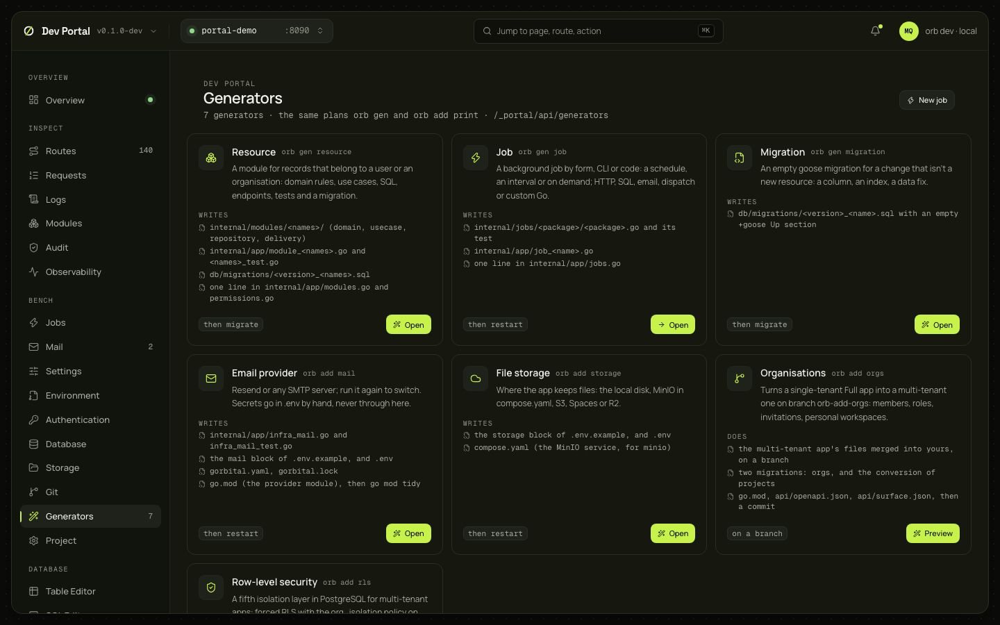

# Generators

Every generator and `orb add` command as a card with a form, a diff preview and Apply, through the same plans the CLI prints with `--dry-run`: `resource`, `job`, `migration`, `add-mail`, `add-storage`, `add-rls` and `add-orgs`. Nothing is written until you apply, and what the preview shows is what gets written.

## What you see

A card per generator the status lists (the count is the sidebar's badge): Resource, Job, Migration, Email provider, File storage, Organisations and Row-level security, each with its CLI command, what it writes (or, for Organisations, what it does), what it needs (a database, a multi-tenant app) and what follows (`then migrate`, `then restart`, `on a branch`). Open (Preview for Organisations) opens a sheet (`?generator=`): the form on top, the equivalent command with a copy button, then the plan. New job in the header goes to the Jobs screen.

| Generator | Form | After apply |
|---|---|---|
| `resource` | Name, belongs to (user or organisation), the fields (name, type, enum values, unique), plural, ID prefix. The rules are the CLI's: snake_case, reserved names, unique on strings only, at least one string, at most 20 fields | Apply migrations, then restart |
| `job` | A link to the Jobs screen's New job sheet ([Jobs](jobs.md)) | Restart |
| `migration` | The name, and the file it becomes | Apply migrations |
| `add-mail` | Provider (Resend or SMTP); for SMTP the host, port, encryption and username. Secrets stay out | Restart |
| `add-storage` | Driver (local, MinIO, S3, Spaces, R2) and the fields the driver reads, with MinIO's defaults as placeholders | Restart |
| `add-rls` | No fields. On a single-tenant app it says it needs `orb add orgs`, and still previews so the CLI's own message shows | Apply migrations, then restart |
| `add-orgs` | No fields; a note on what the branch workflow does | Done |

## What you can do

| Step | What it does |
|---|---|
| Preview | `POST /_portal/api/generators/{name}/plan`: the CLI's summary, every file to create in full and every file to modify as a diff, and the next steps. Nothing is written. Editing the form drops the plan |
| Apply | `POST …/apply`: plans again and writes. Refused for uncommitted changes unless "allow dirty" is ticked; 409 `plan_conflict` when a file changed since the preview, so preview again |
| Restart the app, Apply migrations | Offered after apply by what the generator needs (`POST /_portal/api/app/restart`, `app/migrate`) |

`add-mail` also edits `go.mod` and runs `go mod tidy`. `add-orgs` is different: its plan is the command's dry run (the files it will touch and the branch, without content), and Apply runs `orb add orgs` itself: the branch, the merge, the build, the regenerated `api/`, the commit. It insists on a clean tree, so "allow dirty" is disabled there; the command's output goes to the Overview's console.

## Where it comes from

`GET /_portal/api/status` (the generator names), `POST /_portal/api/generators/{name}/plan` and `apply` with `{"input": {…}, "allow_dirty": bool}`; the inputs are the CLI flags with underscores, and unknown fields are refused. Decided in [ADR-0066](../adr/0066-dev-portal.md) (plans) and [ADR-0077](../adr/0077-generators-hub-first-run-and-project-settings.md) (the hub); the [CLI guide](../guides/cli.md) documents each command.

## Notes

- A generator that needs the database is gated on the Minimal preset ("needs the Full preset").
- The portal's usage errors (422 `generator_failed`) are the CLI's own messages, shown under the field the flag names.
- Every generated file is yours from then on; `orb upgrade` merges newer templates into your edits ([upgrading apps](../start/upgrading.md)).
