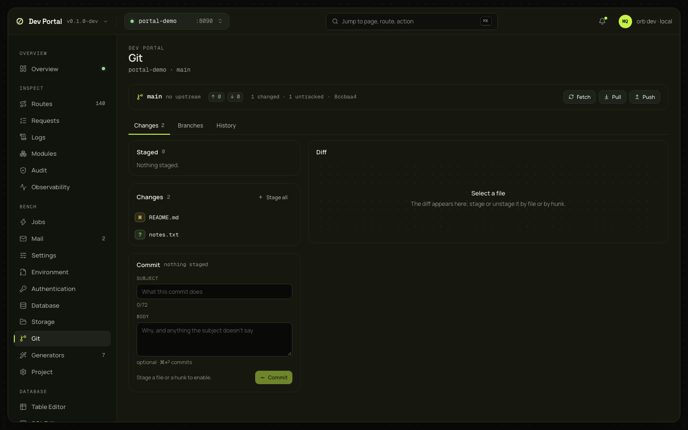

# Git

The app's repository through your own `git`: status, changed files with staging per file and per hunk, a diff viewer, commit, branches, fetch, pull, push, a merge preview, conflicts, and the log with a graph. `orb dev` runs the `git` on your machine in the app directory, so hooks, signing, credential helpers and your configuration apply as in the terminal. Nothing here needs the app to run.

## What you see

| Part | What it shows |
|---|---|
| Header | The branch (or detached HEAD), the upstream or "no upstream", ↑ ahead and ↓ behind, the operation in progress, how many files changed and are untracked, HEAD's hash; Fetch, Pull, Push |
| Changes (`?tab=changes`) | The Staged and Changes lists with the status letters as badges (`M`, `?`…) and renames as old → new, with Stage all and Unstage all; the diff viewer (old and new line numbers, Stage hunk or Unstage hunk per hunk, Stage or Unstage file, Discard, Open in editor, Copy diff; notes for untracked, binary and conflicted files); the commit box (a subject counted against 72 characters and a body; Enter or ⌘⏎ commits; disabled until something is staged) |
| Branches | Local branches with upstream, ahead and behind, merged, last commit; the remote names; New branch, Switch, Delete |
| History | The log with a lane graph, refs as chips, author, relative time; a commit's sheet; Load more |
| Conflicts panel | During a merge: the conflicted files with Open in editor, Mark resolved, Abort merge |
| Remote result sheet | git's output for fetch, pull, push and merge; a refusal in red; a pull's conflicts |

The status refreshes every 5 s while the tab is visible, so a commit or a switch made in the terminal shows up.

## What you can do

| Action | Command behind it | Confirmation |
|---|---|---|
| Stage, unstage a file or a hunk | `git add`, `git restore --staged`, `git apply --cached [-R]` with the hunk's patch | No |
| Discard | `git restore`; `git clean -f` for an untracked file | Yes: "throws away N additions and M deletions in path" |
| Commit | `git commit --file=-` with your message | No |
| New branch, Switch | `git branch`, `git switch` | No |
| Delete a branch | `git branch -d`; `-D` only after the unmerged commits are listed | Yes; "Delete anyway (force)" when unmerged |
| Fetch, Pull, Push | `git fetch --all --prune`, `git pull --no-rebase --no-edit`, `git push` (sets the upstream the first time) | No |
| Merge | A preview first (`git merge-tree --write-tree`): fast-forward or merge commit, the commits, the files, the conflicts in red; then `git merge --no-edit` | The preview |
| Abort merge | `git merge --abort` | Yes: "drops the merge in progress; your commits stay" |
| Open in editor | `ORB_EDITOR` or `VISUAL`, else `code --goto`, else the system opener | No |

### What it never does

- Rewrite history: no rebase, no amend, no reset.
- Push with force, or delete a remote branch.
- Answer a credential prompt: `GIT_TERMINAL_PROMPT=0`. Set up a credential helper or an SSH agent; a command that would prompt fails with git's message instead.

These are refused by the API, not only hidden by the UI.

## Where it comes from

`/_portal/api/git/status`, `diff`, `stage`, `unstage`, `discard`, `patch`, `commit`, `branches`, `switch`, `unmerged`, `fetch`, `pull`, `push`, `merge/preview`, `merge`, `merge/abort`, `conflicts`, `log`, `open`. git's own refusals come back as 409 `git_refused` with its message, shown as it is. Decided in [ADR-0076](../adr/0076-git-screen.md); the [git guide](../guides/git.md) lists the commands.

## Notes

- The merge preview needs Git 2.38 or newer; older versions answer an error for the preview, and merging still works.
- The screen works on the app's repository (the directory `orb dev` runs in), not on nested ones.
- Every command has 30 s; the network ones 2 minutes.
- A directory without a repository shows the `git init` lines (404 `not_a_repository`).
