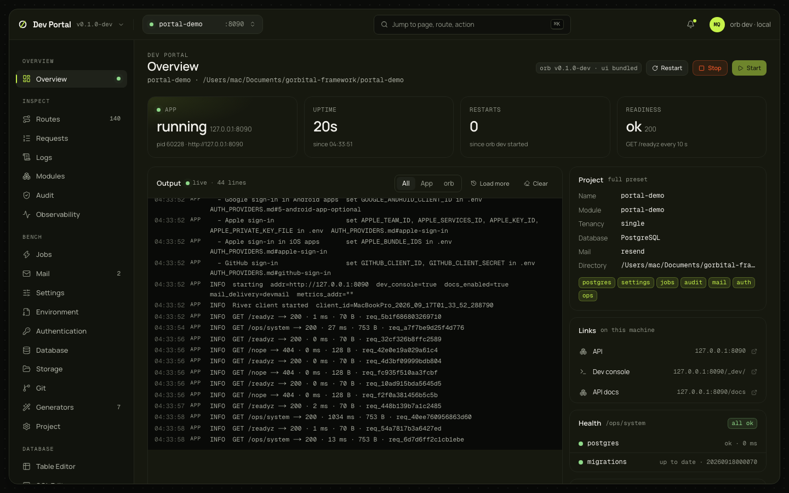

# The Dev Portal

The Dev Portal is the web UI `orb dev` serves at http://127.0.0.1:3100 while it runs your app. It shows what the app is doing (state, output, routes, requests, logs, jobs, email, database) and changes the project from the browser (tables, migrations, jobs, configuration, git). This section has one page per screen. The [Dev Portal guide](../guides/dev-portal.md) has the flags and every endpoint in one place; the decisions are in [ADR-0066](../adr/0066-dev-portal.md) and the records it lists; the plan that built it is the [roadmap](../dev-portal-roadmap.md).



## What it is

- `orb dev` serves it: the UI, the portal's own API under `/_portal/api/`, and a proxy under `/_portal/app/` to the app. None of it is in the app or in a production build, and the portal refuses to start when `APP_ENV` is production.
- The link `orb dev` prints holds a token for this run (`/_portal/auth?t=…`). Opening it once sets the `orb_portal` cookie (HttpOnly, SameSite=Strict), and the portal works for the rest of the run. The next run prints a new link; an old link shows a page saying so.
- Every request for data needs the cookie or `Authorization: Bearer <token>`, a `Host` naming `localhost`, `127.0.0.1` or `[::1]`, and a connection from this machine. Anything but GET and HEAD also needs an `X-Orb-Portal` header, which a page on another site can't send without a preflight the portal never answers.
- In Full apps, the requests the portal proxies to `/ops/` and `/_dev/` run as the development operator: `orb dev` adds the dev console token, the UI never sees it, and the audit log records the actor as `dev console (orb dev)`.
- Code stays the source of truth. Every schema or code change the portal makes is a file in git: a migration under `db/migrations`, a generated Go file, an edited `.env`. What the portal keeps for itself (the log store, the inbox, the SQL history, saved filters) lives under `.orb/portal`, which git ignores and which can be deleted at any time.
- The portal and the CLI share one engine. A button runs the same generator library as `orb gen`, with a plan and a diff preview before anything is written; nothing is possible here that isn't possible from the terminal.

## Opening it

`orb new` creates the app and, in a terminal, starts `orb dev` in it, which opens the portal (`--no-start` skips that, `--start` forces it). From then on `orb dev` prints the link and opens it:

```text
  ✓ Dev Portal http://127.0.0.1:3100/_portal/auth?t=Rk1…vQ (docs/guides/dev-portal.md)
```

| Flag or variable | Effect |
|---|---|
| `--no-open` | Print the link without opening a browser (always the case in CI and when output isn't a terminal) |
| `--no-portal` | Don't serve the portal (the mail catcher doesn't run either) |
| `--portal-port 3110`, or `DEV_PORTAL_PORT=3110` in `.env` | Listen on another port. A taken port stops `orb dev` before anything starts |
| `DEV_PORTAL_TOKEN` in the shell running `orb dev` | Use that token instead of a random one (32 to 512 visible ASCII characters); never written to `.env` |

The link accepts `next`, a path of the portal to land on once the cookie is set: `http://127.0.0.1:3100/_portal/auth?t=<token>&next=/database/schema`. Only paths of the portal itself are accepted; anything else lands on the Overview.

A page saying the link is from another `orb dev` run wants the link the running `orb dev` printed. "orb dev isn't running" means the browser got no answer at all; "Not signed in" means no cookie, or one from an earlier run.

## The screens

The sidebar has four sections.

| Section | Screens |
|---|---|
| Overview | [Overview](overview.md): the app's state, its output as it happens, restart, stop and start |
| Inspect | [Routes](routes.md), [Requests and Logs](requests-and-logs.md), [Modules and Audit](modules-and-audit.md), [Observability](observability.md) |
| Bench | [Jobs](jobs.md), [Mail](mail.md), [Settings and flags](settings-and-flags.md), [Environment](environment.md), [Authentication](authentication.md), [Database](database.md), [Storage](storage.md), [Git](git.md), [Generators](generators.md), [Project settings](project-settings.md) |
| Database | [Table Editor](table-editor.md), [SQL Editor](sql-editor.md), [Schema, Objects and Migrations](schema-objects-migrations.md) |

⌘K opens a palette that jumps to a page, to one of the app's routes, or to an app action. The sidebar badges are live: the route count, the captured mail, the pending migrations.

The portal has a dark and a light theme. It follows the system's colour scheme the first time (dark when the browser states no preference); the sun or moon button in the top bar, next to the bell, and "Toggle theme" in the ⌘K palette switch it, and the choice is remembered per browser. Every screen, including the charts, the SQL editor and the schema diagram, renders in both.

Screens that read `/ops/` (Audit, Jobs, Settings, Authentication, Storage, most of Observability) need a Full app; Minimal apps show what they have. Screens that read the database need `DATABASE_URL` in `.env`. Screens that read `/_dev/` need the app to run with the dev console (`DEV_CONSOLE_TOKEN` declared in `.env.example`, [dev console](../guides/dev-console.md)). An app built with an `orb` that predates the development operator answers 401 on `/ops/`; the page says to rebuild and restart.

## Trying it without an app

The UI runs in mock mode at https://devtools.gorbital.dev: every screen on sample data from an `orb dev` in memory, with the same refusals, versions and delays as the real one. Nothing there reaches an app. A checkout of the UI switches to the same data with `localStorage.devtoolsData = "mock"`.
