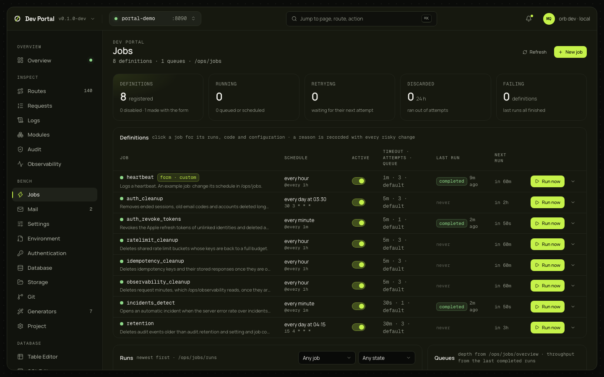

# Jobs

The app's background jobs: every definition with its schedule in plain English, the runs, the queues, and a new job from a form, from the CLI command or in code. A job made here is ordinary Go written by the generator, so it is reviewed, tested and deployed like a hand-written one. Reads `/ops/`, so a Full app.

## What you see

| Panel | What it shows |
|---|---|
| Tiles | Definitions registered (how many disabled, how many made with the form), running, retrying, discarded in 24 h, failing |
| Definitions | Name and description, a source badge, the schedule in plain English ("every hour", "every day at 03:30") over the raw expression, the active toggle, timeout · attempts · queue, last run with its state, next run, Run now, and an expander |
| Runs | The recent runs, newest first, filtered by job and state, with their timings and errors |
| Queues | Depth (`available + scheduled + retryable`), throughput derived from the last 100 completed runs, paused or not |
| Scheduled | Each job's next run ("in 5m · 23:10:02") |

The source badge joins what the running app registered (`/ops/jobs/definitions`) with what is in the code (`GET /_portal/api/jobs`), by name:

| Badge | Meaning |
|---|---|
| `form · custom`, `form · http`… | Made with the form: the definition carries an `//orb:job` marker and the worker file still hashes to it; the detail shows the form's fields read-only |
| Ejected: edit in code | The worker file was edited since it was generated. The form never offers to overwrite it |
| No badge | A hand-written job, without a marker |

A job's detail (`?job=`) has three tabs. Overview: the source, the marker's fields, the files. Runs: the history, 25 a page; a run expands to its timings, the errors per attempt, the request ID, and its log records (the console's records with the run's `job_id`) with "open in Logs". Configure: schedule, timeout, attempts, queue, priority.

## What you can do

| Action | What it does | Confirmation |
|---|---|---|
| Run now | `POST /ops/jobs/definitions/{name}/run`. Refused (429) within a minute of the last run | No |
| Enable, disable | Changes the definition with the version you last read | Disabling asks for a reason |
| Reschedule; change the timeout, attempts or queue | The same, and undoing those | A reason |
| Retry, cancel a run | On the run | No |
| Pause, resume a queue | On the queue | Pausing asks for a reason |
| Duplicate as new | Pre-fills the New job form from a generated job's marker and defaults | No |
| New job | Below | Apply writes files; a dirty git tree is refused unless "allow dirty" is ticked |

Every change is audited as the dev operator. A stale version answers 409; the page refetches and asks you to look again.

### New job

One form state, three tabs.

- **Form**: name (the derived identifier, definition file and package are shown), description, trigger (a schedule with presets or a raw cron, an interval with presets or a raw duration, or on demand; the plain-English reading under it), timeout, attempts, queue, priority, enabled, and the kind. Preview posts the plan and shows every file the generator would write: a created file in full, a modified one (`internal/app/jobs.go`) as a diff, and the next steps. Create writes them.
- **CLI**: the equivalent `orb gen job …` with only the flags that differ from the defaults, to copy.
- **Code**: what the custom kind means, the files the generator will write with the one to open, and the worker in a read-only editor.

| Kind | What the generated `Work` does |
|---|---|
| `custom` | Logs a line, for you to write |
| `http` | Sends the request with the app's HTTP client (30 s timeout); a non-2xx answer is an error, so the job is retried |
| `sql` | Runs one statement on the app's pool |
| `email` | Sends the message through the app's mailer (settings and suppressions apply), with the job ID as idempotency key |
| `dispatch` | Starts another job by name |

The files are on disk after Create, but the app doesn't know the job until it rebuilds: the footer offers Restart the app, then waits for the definition to appear and opens it. The values a kind takes (URL, statement, message, target) are constants at the top of the worker file; to vary them per run, move them into `Args` and eject.

## Where it comes from

`/ops/jobs/definitions`, `/ops/jobs/runs`, `/ops/jobs/overview`, `/ops/queues` ([ops API](../guides/ops-api.md#job-definitions)), `GET /_portal/api/jobs`, `POST /_portal/api/generators/job/plan` and `apply`, and `/_dev/logs` for a run's records. Kinds, markers and ejection are decided in [ADR-0071](../adr/0071-job-kinds-and-ejection.md); the [background jobs guide](../guides/background-jobs.md#jobs-from-the-portal) shows the generated code.

## Notes

- Run now takes no arguments, and enqueue-for-later isn't offered: both wait for an ops endpoint that takes them (roadmap item 56).
- The ops API never returns a run's arguments; the detail says so.
- There is no "edit" for an existing job, because the generator refuses files that exist. Duplicate as new, or edit the code.
- Editing the marker's JSON by hand doesn't eject: only the worker file's hash counts.
