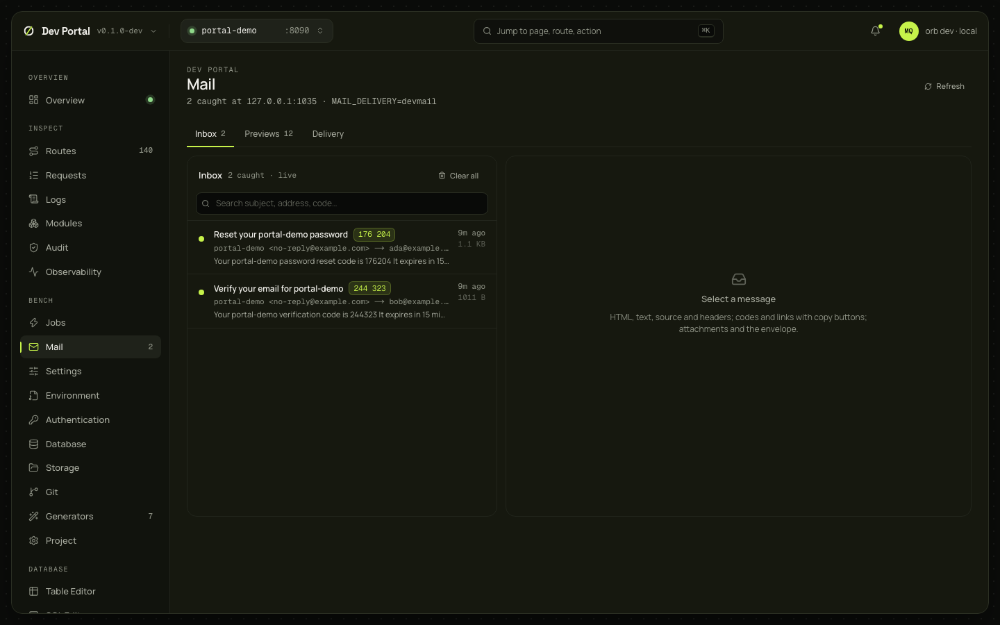

# Mail

The inbox of every email the app sent in development, the app's email previews rendered with sample data, and the delivery configuration. `orb dev` runs an SMTP catcher on `DEV_MAIL_SMTP_ADDR` (`127.0.0.1:1025` by default) when `MAIL_DELIVERY` is `devmail`, the development default, so nobody real is emailed.

## What you see

Three tabs (`?tab=inbox|previews|delivery`).

| Tab | What it shows |
|---|---|
| Inbox | Search over subject, address and code; the list (unread marked, subject, verification-code chips, from → to, snippet, time and size, attachment count), newest first, updated live as messages arrive; Clear all. The page header counts what was caught, the catcher's address and `MAIL_DELIVERY` |
| A message (`?id=`) | From, To, Cc, Reply-To; the codes bar with copy; HTML (sandboxed, light or dark), Text, Source and Headers; the links (open, copy), the attachments, the SMTP envelope |
| Previews | The app's email previews grouped by category: sign-in's messages and a plain test message. An app on `gorbital.Main` gets them from its modules, which register them during `Setup` with `gorbital.AuthSetup.MailPreviews` — `authhttp` does it for sign-in's — and a v0.1 app lists them in `internal/app/mail_previews.go`, where you add your own. Each is rendered for a recipient you type, as HTML and text, with the subject and text to copy |
| Delivery | The app's mail status from `/ops/mail`, a test email, and the suppression list |

## What you can do

| Action | What it does | Confirmation |
|---|---|---|
| Open a message | Marks it read | No |
| Copy a code, a link, the subject | To the clipboard | No |
| Delete, Clear all | Removes one message, or every message, from `.orb/portal/mail` | Yes |
| Send to inbox (Previews) | Renders the preview through the app's mailer, so it lands in the inbox like a real message; the page switches to it | No |
| Send a test email (Delivery) | `POST /ops/mail/test`; refused (429) after five in an hour | No |
| Remove a suppression | Lets the app email that address again | A reason |

## Where it comes from

`GET /_portal/api/mail`, `mail/stream`, `mail/{id}`, `mail/{id}/html`, `mail/{id}/source`, `DELETE mail/{id}`, `DELETE mail`; through the proxy, `/_dev/mail/previews`, `/_dev/mail/preview`, `/_dev/mail/preview/send` and `/ops/mail…` ([ops API](../guides/ops-api.md#email)). Decided in [ADR-0074](../adr/0074-dev-mail-previews-and-env-editor.md); the [email guide](../guides/email.md#development-the-inbox-in-the-dev-portal) covers the catcher, Mailpit and the providers.

## Notes

- The inbox is `orb dev`'s, not the app's: it survives the app's restarts and a stopped app. It keeps the last 500 messages.
- HTML renders in a sandboxed frame: no scripts, an opaque origin, images and inline styles only.
- The catcher speaks the minimum SMTP, with no STARTTLS and no AUTH. `MAIL_DELIVERY=mailpit` shows Mailpit's inbox through the console instead; `provider` sends for real.
- Without the portal (`orb dev --no-portal`) the catcher doesn't run.
- Previews and their send need the dev console. The codes the [Authentication](authentication.md) screen lists are read here, because the app stores them hashed.
