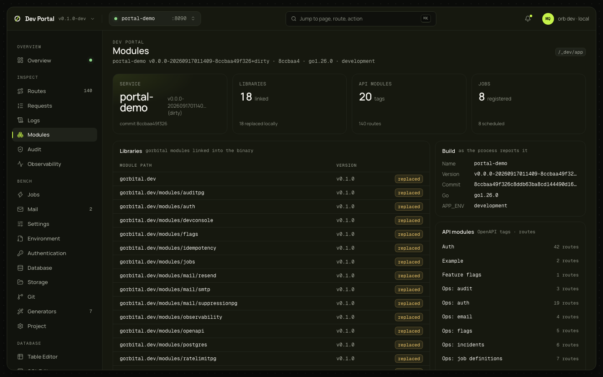
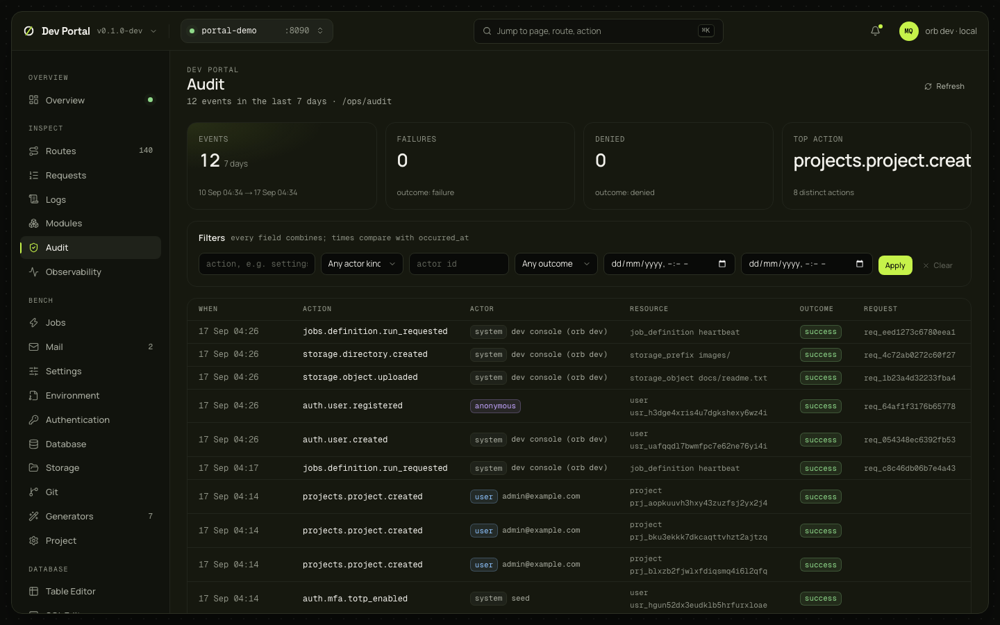

# Modules and Audit

Modules shows what the app wired at startup. Audit shows the audit log the app keeps, with filters and statistics.

## Modules

### What you see

The app's own report of itself from `/_dev/app`. The header names the service, its version, commit, Go version and `APP_ENV`. Four tiles: the service, the libraries linked (and how many are replaced by a local checkout), the API modules (OpenAPI tags, with the route count) and the jobs registered. Below: the gorbital modules linked into the binary with their version and a `replaced` badge for a local `replace` directive, the build as the process reports it, and the API modules with their route counts, followed by the settings, flags and permission catalogs the app declared.

### What you can do

Read only.

### Where it comes from

`GET /_portal/app/_dev/app` ([dev console](../guides/dev-console.md), [ADR-0065](../adr/0065-local-dev-console-apis.md)). Needs the app to run with the console.

## Audit

### What you see

Four tiles for the last 7 days: events, failures, denied, and the top action with the number of distinct actions. Filters that combine: action, actor kind, actor ID, outcome, from and to. The events newest first, paged by cursor: when, action, actor (kind badge and label), resource, outcome, request ID; an event opens to its metadata.

Changes made from the portal appear here with the actor `dev console (orb dev)` (kind `system`), so they are told apart from an administrator's.

### What you can do

Filter, page and read. Nothing is deleted from here; retention is a runtime setting ([ops API](../guides/ops-api.md#retention)).

### Where it comes from

`GET /_portal/app/ops/audit` and `/ops/audit/stats` ([ops API](../guides/ops-api.md#audit-log)), as the development operator ([ADR-0066](../adr/0066-dev-portal.md)). The actions are listed in the [audit actions reference](../reference/audit-actions.md).

### Notes

Reads `/ops/`, so a Full app. An app built with an `orb` that predates the development operator answers 401; the page says to rebuild and restart.
