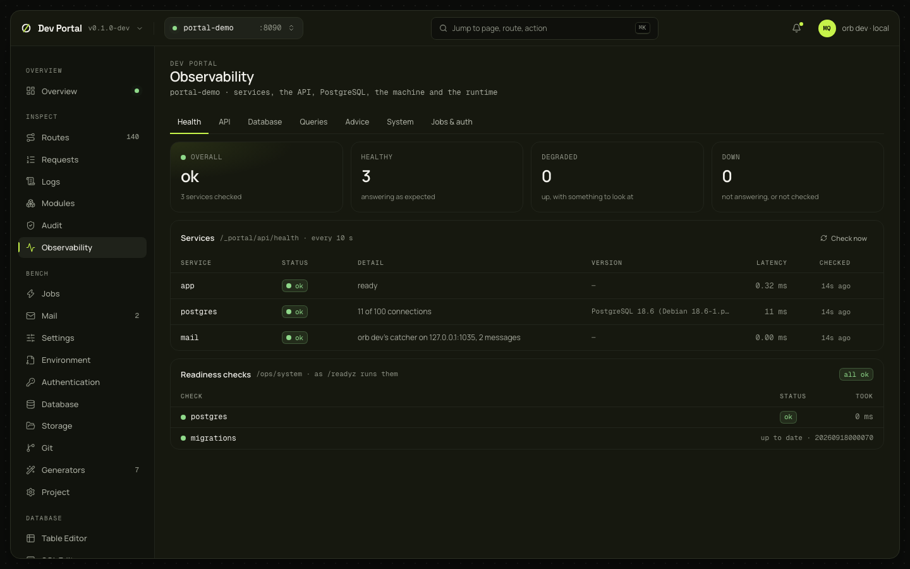

# Observability

Service health, the API's rates and percentiles per route, the database's statistics, query performance, index advice, the machine and the Go runtime, jobs and sign-ins: what the app reports to operators, plus what only `orb dev` can see on this machine. The API, Jobs and auth tabs read `/ops/` (a Full app); Database, Queries and Advice read the database.

## What you see

The screen is tabs (`?tab=`); each polls only while it is open.

| Tab | What it shows |
|---|---|
| Health | Tiles for overall, healthy, degraded and down; a table of services polled every 10 s (Check now polls at once): the app, PostgreSQL (connections against `max_connections`, sessions waiting on locks, the server version), the mail catcher or Mailpit, every other Compose service from `docker compose ps`, each with status, detail, latency and when it was checked; then the app's readiness checks as `/readyz` runs them |
| API | Request rate, error rate, p50, p95 and p99 for a window (15m, 1h, 6h, 24h), a per-minute chart, the five slowest and the five most failing routes, and every route's figures; a badge says the stream is live |
| Database | Connections by application and state, cache and index hit ratio gauges, the pool's counters, commits, rollbacks and deadlocks, the largest tables with their scans and dead rows, lock waits with the blocking PIDs, statements running for over a second |
| Queries | `pg_stat_statements` sorted by total time, mean time, calls, rows or max time, each with its share of the total; Explain, Open in SQL editor, Refresh, Reset |
| Advice | Foreign keys without an index, indexes never scanned, tables read mostly by sequential scans, tables waiting for a vacuum, each with its numbers and the SQL to run |
| System | The host's CPU, load, memory and the app directory's volume; the app process and `orb` (CPU, resident memory, threads, open files); the Go runtime (goroutines, heap, GC); sparklines over the last 60 samples |
| Jobs and auth | Queue depths from the jobs overview, `auth.*` audit events by action, sign-ins by method |

Hit ratios are graded: 99% and above good, 95% ok, below poor. CPU, memory, disk and connections: 90% poor, 70% ok.

## What you can do

| Action | What it does | Confirmation |
|---|---|---|
| Explain (Queries) | `EXPLAIN` on the statement's normalised text, always rolled back; a generic plan where `$n` placeholders remain | No |
| Open in SQL editor | Copies the statement, or an advice row's SQL, into the [SQL Editor](sql-editor.md)'s draft | No |
| Reset (Queries) | Forgets `pg_stat_statements`' counters. Nothing else changes | Yes |
| A table's name (Database, Advice) | Opens it in the [Table Editor](table-editor.md) | — |

Nothing here writes to the app or the project.

## Where it comes from

`GET /_portal/api/health`, `/_portal/api/system`, `/_portal/api/db/stats`, `/_portal/api/db/statements`, `POST /_portal/api/db/statements/reset`, `GET /_portal/api/db/advice`; through the proxy, `/ops/observability/overview`, `/ops/observability/routes`, `/ops/observability/stream`, `/ops/system`, `/ops/jobs/overview`, `/ops/audit/stats` and `/ops/audit`. Decided in [ADR-0073](../adr/0073-observability-screen.md); the [observability guide](../guides/observability.md#the-observability-screen) explains each source.

## Notes

- Queries needs `pg_stat_statements` preloaded. The development `compose.yaml` does it (`shared_preload_libraries=pg_stat_statements`), and `orb dev` creates the extension on first use; an app whose container predates that line must recreate it (`docker compose up -d --force-recreate postgres`). Until then the tab shows the reason and the line to add.
- The System sample is the machine's, every 2 seconds. With the app in Docker, the numbers would be the host's.
- Traces aren't here: `orb dev --observability` starts Grafana for them. The OTLP receiver sketched in the roadmap was deferred.
- Advice is a suggestion with its numbers, not a decision: check it against real traffic before writing a migration.
