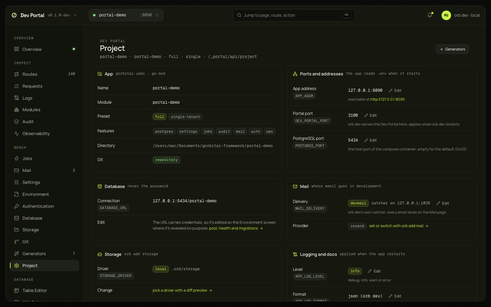

# Project settings

The app as the manifest, `go.mod` and `.env` describe it: name, module, preset, ports, database, mail delivery, storage driver, CORS origins, logging and docs, each with the environment key behind it and an editor for that key; API and service-account keys from the ops API; and a danger zone that resets the database or clears what the portal keeps.

## What you see

| Section | What it shows | Key |
|---|---|---|
| App | Name, module, preset, tenancy, features, directory, whether it is a git repository | read-only |
| Ports and addresses | The app's address (with the URL it is reachable at), the portal's port (applied when `orb dev` restarts), PostgreSQL's host port | `APP_ADDR`, `DEV_PORTAL_PORT`, `POSTGRES_PORT` |
| Database | The connection as host, port and database, never the password; a pointer to Environment for the URL and to the Database screen for the pool, health and migrations | `DATABASE_URL` |
| Mail | The delivery (`devmail` with the catcher's address) and the provider, with a link to the Email provider generator | `MAIL_DELIVERY` |
| Storage | The driver and its directory, with a link to the File storage generator | `STORAGE_DRIVER` |
| CORS | The origins as rows, each validated (scheme and host, no path, no wildcard) | `APP_CORS_ORIGINS` |
| Logging and docs | Level, format (shown as `json (orb dev)` when empty), docs enabled | `APP_LOG_LEVEL`, `APP_LOG_FORMAT`, `APP_DOCS_ENABLED` |
| Keys | Service accounts with their API keys | `/ops/service-accounts` |
| Danger zone | One row per action, with what it loses | |

The screen never guesses a key: the settings name it, and the editor writes exactly that key.

## What you can do

| Action | What it does | Confirmation |
|---|---|---|
| Edit a value | `PUT /_portal/api/env {"set": {KEY: value}}`: the same in-place edit as [Environment](environment.md); a banner offers Restart the app | No |
| Create a service account, create a key (shown once), revoke, delete | `/ops/service-accounts…` ([API keys guide](../guides/api-keys.md#service-accounts)) | Delete asks |
| Reset the database | `POST /_portal/api/project/reset-database`: drops the `public` schema, then migrations and seed data run through the supervisor. 202; the migrator's output goes to the Overview's console | Type `reset` |
| Clear the log store | `DELETE /_portal/api/logs` (`.orb/portal/logs`) | Yes |
| Clear the inbox | `DELETE /_portal/api/mail` (`.orb/portal/mail`) | Yes |
| Clear the SQL history | `DELETE /_portal/api/db/sql/history` | Yes |

Each danger row's dialog quotes what it loses. Unavailable rows (no database, no store) are disabled with the reason.

## Where it comes from

`GET /_portal/api/project`, `POST /_portal/api/project/reset-database`, `GET` and `PUT /_portal/api/env`, `/ops/service-accounts…`. Decided in [ADR-0077](../adr/0077-generators-hub-first-run-and-project-settings.md).

## Notes

- Resetting the database is a `DROP SCHEMA public`: extensions installed in `public` go with it, and the migrations recreate what the app needs.
- Service-account keys stay personal: `/ops/service-accounts` wants a signed-in principal, and the development operator is refused (401). The section says so in place of the list; create keys as a signed-in administrator ([API keys guide](../guides/api-keys.md#service-accounts)).
- `DATABASE_URL` carries credentials, so it is edited on [Environment](environment.md), where a secret is revealed on request.
- An `orb dev` without the env editor shows the values read-only.
