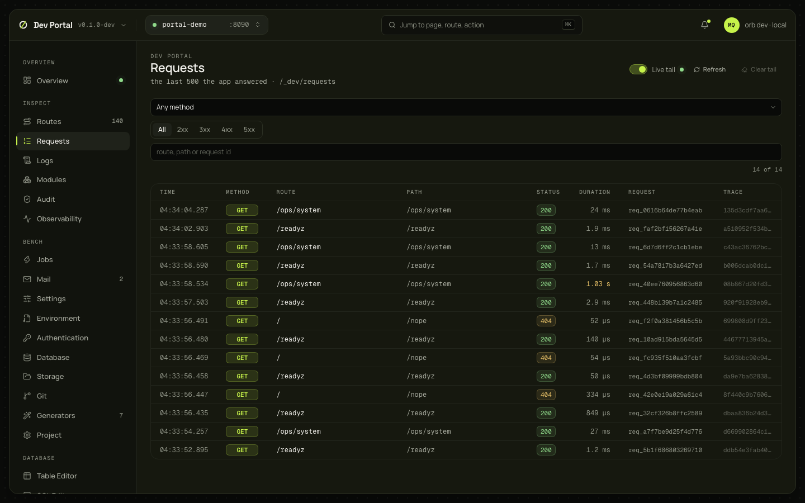
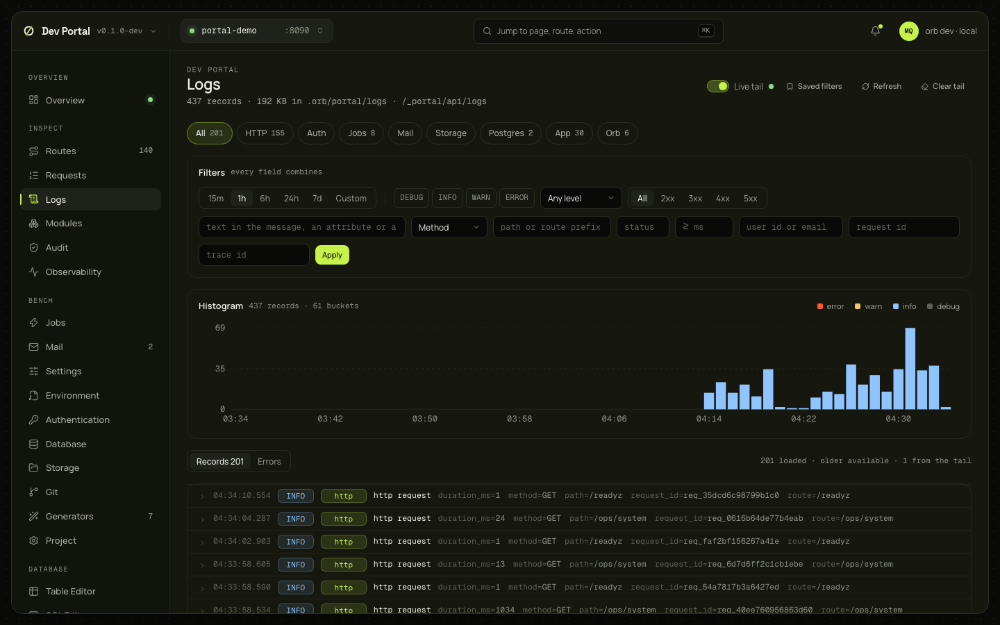

# Requests and Logs

Two screens for what the app did. Requests is the live list of HTTP requests the app answered, from the dev console's buffer. Logs is the portal's log store: every record the app, `orb dev` and PostgreSQL wrote, kept on disk across restarts, with filters, a histogram, a live tail and an errors view.

## Requests

### What you see

The last 500 requests the app answered, newest first: time, method, route, path, status, duration, request ID and trace ID. Filters by method, status class (2xx to 5xx) and route, path or request ID; a Live tail switch, Refresh and Clear tail (the view only). A row opens the request's detail with every log record that carries its request ID.

### What you can do

Read. Nothing here changes anything. The detail's records link to Logs with the request ID as the filter.

### Where it comes from

`GET /_portal/app/_dev/requests` and the stream `/_dev/requests/stream` ([dev console](../guides/dev-console.md#requests), [ADR-0065](../adr/0065-local-dev-console-apis.md)); the detail reads `GET /_portal/api/logs/request/{id}` and falls back to `/_dev/logs` on an `orb dev` without a store.

### Notes

The console's buffer restarts empty with the app. What happened before a restart is on Logs.

## Logs

### What you see

| Part | What it shows |
|---|---|
| Header | The record count and the store's size in `.orb/portal/logs`; Live tail, Saved filters, Refresh, Clear tail |
| Source chips | All, HTTP, Auth, Jobs, Mail, Storage, Postgres, App, Orb, each with the count of loaded records; click to filter |
| Filter bar | The time range (15m, 1h, 6h, 24h, 7d, or Custom), levels (DEBUG, INFO, WARN, ERROR) or a minimum level, status class (2xx to 5xx) or status, free text (the message, an attribute or a raw line), method, path or route prefix, minimum duration in ms, user ID or email, request ID, trace ID; Apply |
| Histogram | Records per bucket over the window (1 minute up to 2 hours, then 5, 15 or 60), stacked by level |
| Records tab | "N loaded · older available · N from the tail", then each record: time, level, source, message and the key attributes (`duration_ms`, `method`, `path`, `request_id`, `route`…); expanded, every attribute with a copy button and the actions |
| Errors tab | Records at WARN and above grouped by fingerprint (the message's shape, with numbers, IDs, hex and quoted values replaced, plus the first line of the stack or error): source, level, count, first and last seen; a group expands to its last record |
| Footer | The store's size against its 64 MiB, records, segments, the oldest record; Clear |

Every filter lives in the URL with the API's own names (`/logs?range=6h&source=http,auth&status_class=5xx&q=timeout`), so a view can be bookmarked or linked from another screen. The Jobs screen links here with `?q=job_id=<id>`.

### What you can do

| Action | What it does |
|---|---|
| Live tail | Follows new records that match the filters. While you have scrolled into the list, new records wait behind an "N new records" pill. Off when the window doesn't end now |
| Click a bar, drag across bars | Zooms the window to those buckets and pauses the tail; Reset zoom returns to the preset |
| Load older | Pages backwards |
| All logs for this request, Filter by user, Filter by trace, Details | Set the matching filter from a record, or open its sheet |
| Saved filters | Name the current filters and apply them later; kept in `.orb/portal/log-filters.json`. A name that exists is replaced |
| See records (Errors tab) | Switches to the records of a group |
| Clear | Deletes the store (`.orb/portal/logs`) after a confirmation. Also from [Project settings](project-settings.md) |

### Where it comes from

`GET /_portal/api/logs`, `logs/histogram`, `logs/stream`, `logs/errors`, `logs/request/{id}`, `logs/stats`, `GET`, `PUT` and `DELETE logs/filters`, `DELETE /_portal/api/logs`. The store is decided in [ADR-0072](../adr/0072-local-log-store.md) and described in the [observability guide](../guides/observability.md#the-local-log-store).

### Notes

- The store is JSON Lines under `.orb/portal/logs` (gitignored, mode 0600): segments of 8 MiB, 64 MiB in all, the oldest dropped first. `grep` works on it too.
- Records are structured because `orb dev` runs the app with `APP_LOG_FORMAT=json` unless `.env` chose otherwise; the terminal still shows text.
- The `postgres` source comes from `docker compose logs`; with `--no-services` there is none.
- Search is a case-insensitive substring scan. The fingerprint is a heuristic: two problems with the same message shape group together, and a rewritten message splits a group.
- An `orb dev` from before the store answers 404 `no_log_store`; the page says to rebuild.
