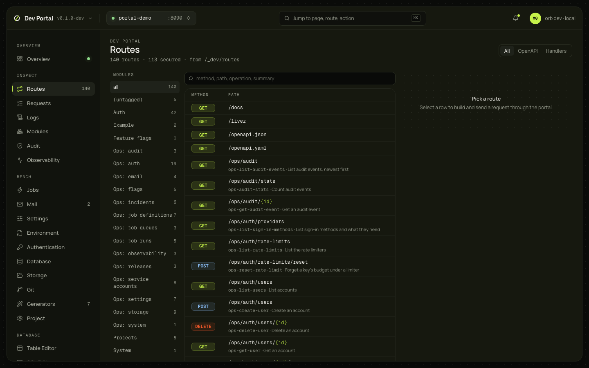

# Routes

Every route the app registered, with its guards, whether it is public, its middleware and where it is in the source, and a request builder that sends a request through the portal's proxy and shows the answer. The list and the builder read the dev console, so the app must run with it ([dev console](../guides/dev-console.md)); guards, middleware and sources come from the same data as [`orb routes`](../guides/cli.md#orb-routes), which the portal can build while the app is stopped.

## What you see

| Panel | What it shows |
|---|---|
| Header | The route count, how many are public, and filters: All, OpenAPI (routes the document describes) or Handlers, and Public |
| Modules | The routes grouped by their OpenAPI tag (`Auth`, `Ops: audit`, `Projects`, `(untagged)`…) with a count each |
| The list | Every route with its method, path, operation ID and summary, a **public** badge on routes that need no sign-in, and chips for its guards (`permission:…`, `rate_limit:…`, `webhook…`); a search over method, path, operation and summary. The count is the sidebar's badge |
| Route details | The module, the guards in the order they run, the middleware (`Module.Middleware`, then each group's `gorbital.Use`, then the route's), the handler, and the source as `file:line` for the registration and the handler's declaration; a source opens in your editor. In an app on the v0.1 layout the guards are unknown and say so |
| Request builder | Opens on a route ("Pick a route" until then): the path parameters, the query, headers, a JSON body, and the auth mode |
| Response | The status, the duration, the headers worth showing and the body |

Rows under `/v1/auth/` link to [Testing sign-in](testing-sign-in.md), on the method the route belongs to.

Auth modes: none, or a bearer token you paste (a session token or an API key). The token "Act as user" hands over from the [Authentication](authentication.md) screen is read when the builder opens; the builder switches to it and says whom it acts as.

## What you can do

- Find the public routes with the Public filter, and check each route's guards before it ships.
- Open where a route is registered, or its handler, in your editor.
- Fill a route's parameters and send it. The request goes through `/_portal/app/…`, so it reaches the app from `127.0.0.1`; a request to `/_dev/` or `/ops/` that carries no `Authorization` header gets the dev console token added by `orb dev`.
- Paste a bearer token to call `/v1/` as a user or an API key.
- Act as a user: "Use in Routes" on an account stores an impersonation token in this tab's `sessionStorage` (never in the URL) and opens the builder with it.

A request sent from the builder does whatever the route does: a `DELETE` deletes. Nothing is confirmed.

## Where it comes from

`GET /_portal/app/_dev/routes` and the proxy for the request itself. Guards, public routes, middleware and sources: `GET /_portal/api/routes`, which answers `orb routes --json`'s list without `schemaVersion`: from the running app's `/openapi.json`, or from `go run ./cmd/api openapi` when the app isn't running (a few seconds the first time), joined with a `go/parser` scan of the app's source; 422 `routes_failed` with the build's message when the document can't be made. Routes are joined by method and path. Sources open through `POST /_portal/api/git/open`. [ADR-0065](../adr/0065-local-dev-console-apis.md) decided the console; [ADR-0066](../adr/0066-dev-portal.md) the proxy and the development operator.

## Notes

- The "none" auth mode sends no header, but the proxy still adds the dev operator on `/ops/` and `/_dev/`. A pasted bearer token is the way to test those paths as somebody else.
- The SQL spans of a request aren't shown in the builder; the request's records are on [Logs](requests-and-logs.md#logs), with "All logs for this request".
- A route registered by a library module, or through code that builds its path at run time, has no source; the list's notes say how many.
- Impersonation only works while the app runs with the dev console; elsewhere it answers 403 `impersonation_off`.
