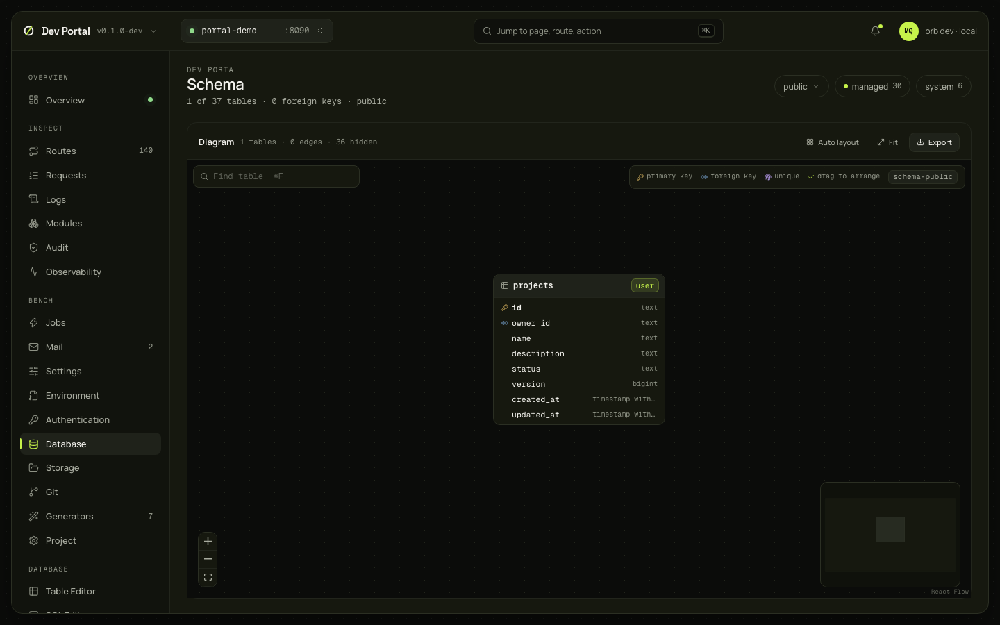
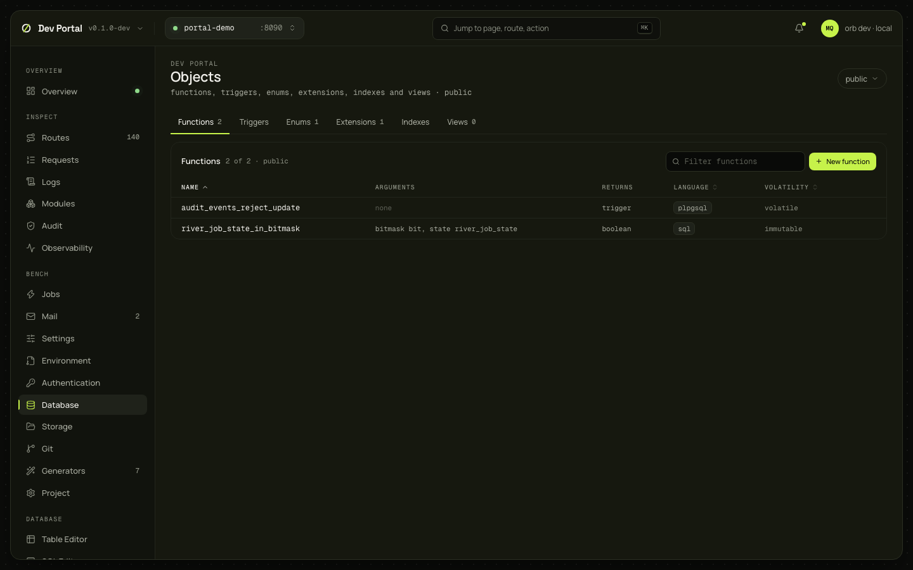
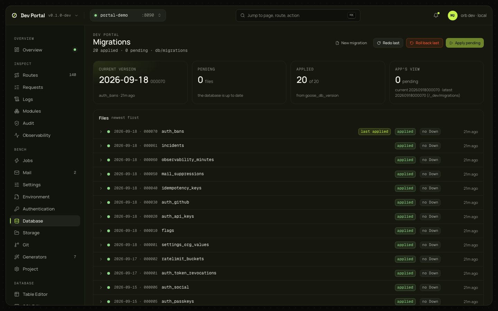

# Schema, Objects and Migrations

Three screens under Database that show the database as a whole and change it through migrations. They need a database.

## Schema

### What you see

The header counts the tables drawn, the foreign keys and the schema; a schema dropdown and the `managed` and `system` toggles with their counts. The diagram: the tables as nodes with an ownership badge, one row per column with its type and the primary key, foreign key and unique icons, and the foreign keys as edges drawn between the columns they join; a legend, Find table, Auto layout, Fit, Export, zoom controls and a minimap. Tables that foreign keys join are laid out left to right; the rest sit in a grid beside them. Hovering a table lights up its neighbourhood. Managed and system tables (about 30 in a Full app) are hidden by default; two toggles show them.

### What you can do

| Action | What it does |
|---|---|
| Drag a table | Positions are kept in the browser per set of schemas; Auto layout clears them |
| Find (⌘F) | Matches stay lit while the rest fade; Enter centres the first match |
| Export | A PNG or SVG of the viewport, or the diagram as a Mermaid `erDiagram` (copied, or downloaded as `.mmd`) |
| Click a table | Opens it in the [Table Editor](table-editor.md) |

Nothing here writes to the database or the project.

### Where it comes from

`GET /_portal/api/db/tables`, `db/tables/{schema}/{table}` and `db/foreign-keys`; the drawing is the browser's ([ADR-0069](../adr/0069-schema-visualiser-objects-and-migrations.md)).

## Objects

### What you see

A schema dropdown and a tab per kind with its count: Functions (name, arguments, returns, language, volatility), Triggers, Enums, Extensions, Indexes (with their usage counts), Views; a filter box and a New button per tab; an object opens to its definition.

### What you can do

Every create and drop is a migration, through one plan dialog: the summary, the Up and Down SQL, the notes, the `irreversible` and `NO TRANSACTION` flags and the file's path; you can rename the migration and allow a dirty tree; Apply writes the file and applies it, and the tab refetches.

| Kind | Create | Drop |
|---|---|---|
| Extensions | `create_extension` | `drop_extension` |
| Functions | `create_function`, the whole `CREATE FUNCTION` you write | `drop_function`, by signature (`name(argument types)`) |
| Triggers | `create_trigger`, the whole statement | `drop_trigger` |
| Views | `create_view`, the `SELECT` | `drop_view` |
| Enums | `create_enum`, `add_enum_value`, `rename_enum_value` | `drop_enum` |
| Indexes | `create_index` (`CONCURRENTLY` marks the file `NO TRANSACTION`) | `drop_index` |

A drop passes the catalog's definition so the Down recreates the object; without it the drop is marked irreversible. Managed and system objects are refused (403 `system_table`).

### Where it comes from

`GET /_portal/api/db/functions`, `enums`, `extensions`, `views`, `tables/{schema}/{table}` (for triggers and indexes); `POST db/ddl/plan` and `apply` ([ADR-0069](../adr/0069-schema-visualiser-objects-and-migrations.md)).

## Migrations

### What you see

Four tiles: the current version (its name and when), pending files, applied files against `goose_db_version`, and the app's own view from `/_dev/migrations`. Then every file under `db/migrations`, newest first, with its date, number and name, the badges `applied`, `last applied` and `no Down`, and when it was applied; expanded, its SQL. Versions the database recorded without a file are listed too. Pending migrations are also the sidebar's badge.

### What you can do

| Action | What it does | Confirmation |
|---|---|---|
| Apply pending | `POST /_portal/api/app/migrate`: `go run ./cmd/migrate` through the supervisor, without a restart | No |
| Roll back last | `migrate-down`: `cmd/migrate --down` rolls back the most recent migration, one step | No |
| Redo last | `migrate-redo`: rolls it back and applies it again, which is how you check that its Down works | No |
| New migration | The `migration` generator: an empty file named after your input, previewed, then written under `db/migrations` | The preview |

The three actions answer 202; the outcome arrives as state events and the list refreshes. A failed migrate shows the supervisor's problem with a link to the Overview's output.

### Where it comes from

`GET /_portal/api/db/migrations`, `POST /_portal/api/app/migrate`, `migrate-down`, `migrate-redo`, `POST /_portal/api/generators/migration/plan` and `apply` ([ADR-0069](../adr/0069-schema-visualiser-objects-and-migrations.md), [database guide](../guides/database.md#migrations)).

### Notes

- `--down` and `--redo` are refused when `APP_ENV` is production; released migrations stay forward-only. Development gets the undo.
- Redo re-applies only the most recent migration; older ones need repeated roll backs.
- A migration without a Down section rolls back as a versioned no-op: goose records it as unapplied while its objects remain. The list flags such files.
- Write a new migration's SQL before applying it: an empty migration is recorded as applied.
- River's tables are never rolled back.
