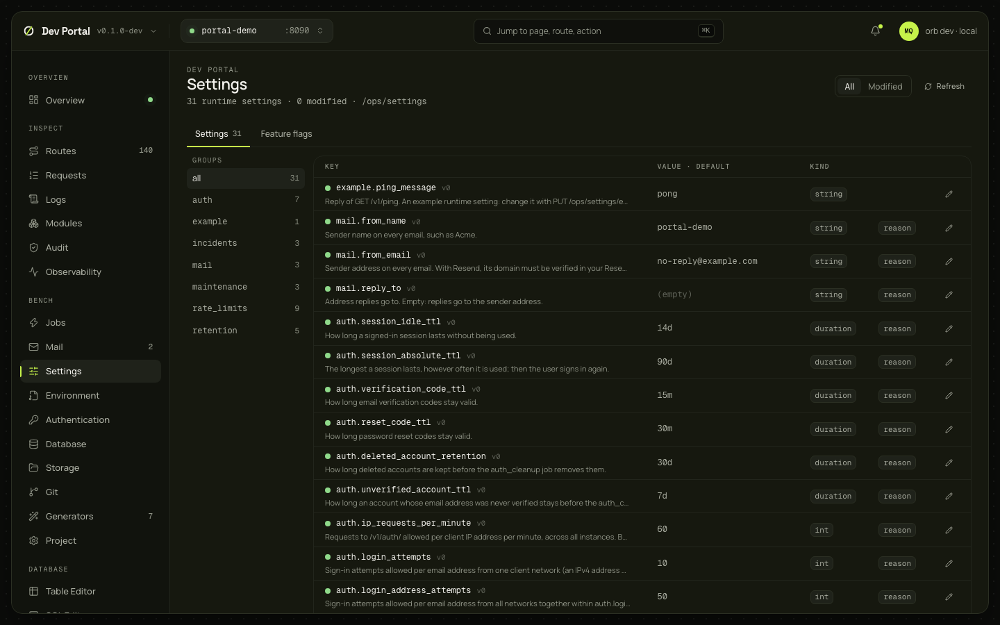

# Settings and flags

Runtime settings and feature flags are values the app reads from its database and changes without a restart ([runtime settings](../guides/runtime-settings.md), [feature flags](../guides/feature-flags.md)). This screen lists them by group with their history and changes them as an operator would, through `/ops/`. Reads `/ops/`, so a Full app.

## What you see

Two tabs (`?tab=flags` for the second; the open flag is `?flag=`).

| Tab | What it shows |
|---|---|
| Settings | A group list (`auth`, `mail`, `rate_limits`, `retention`…) with counts, and All or Modified; every setting: key with its description and version, the current value and the declared default, its kind (`bool`, `int`, `float`, `string`, `enum`, `duration`, `string_list`), the current value, the declared default, a `modified` badge, the version, and whether a change needs a reason. A setting's sheet has a typed input with its constraints (`min`, `max`, `one_of`, `max_len`, `max_items`, `format`) as a hint, and the history: old value, new value, reason, actor |
| Feature flags | Every flag with its state in words ("off", "on for everyone", "25% rollout · 3 targets"), the declared state under a modified one, the `modified`, `client` and `invalid` badges, and the version. A flag's sheet has the whole state as a form (enabled, default, the rollout percentage, users and organisations to allow or deny, one ID per line), and the history |

## What you can do

| Action | What it does | Confirmation |
|---|---|---|
| Change a setting | Sends the value with the version you read; stored in the database, and the app sees it on its next read | A reason when the setting is marked `reason_required` |
| Reset a setting | Back to the declared default | A reason |
| Save a flag as vN+1 | Sends the state with the version and a reason | Always a reason |
| Reset a flag to declared | Removes the stored state | A reason |

The form refuses what the app would refuse before sending: a percentage outside 0 to 100, an ID in both the allow and the deny list. A stale version answers 409 `*_version_conflict`; the page refetches and asks you to look again. Every change is audited as the dev operator and shows in the history with that actor.

## Where it comes from

`/ops/settings…` and `/ops/flags…`, each key with its history ([ops API](../guides/ops-api.md#runtime-settings)), as the development operator ([ADR-0066](../adr/0066-dev-portal.md)); the flags tab arrived with [ADR-0074](../adr/0074-dev-mail-previews-and-env-editor.md).

## Notes

- Settings and flags live in the database, not in `.env`. A variable the app reads at startup is edited on [Environment](environment.md).
- Per-organisation setting values aren't edited here.
- What a setting means and its constraints come from the app's declarations (`internal/app/settings.go`, `flags.go`); the [settings reference](../reference/settings.md) lists a Full app's.
