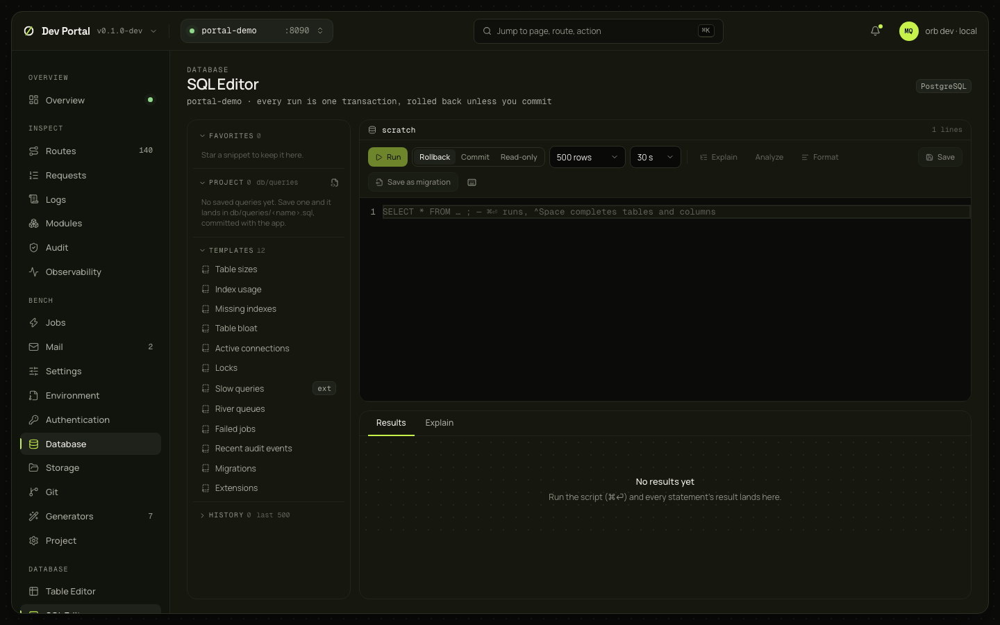

# SQL Editor

Scripts against the development database, run in one transaction that is rolled back unless you choose to commit; results per statement; warnings before a destructive run; `EXPLAIN`; snippets saved in the app under `db/queries`; history; templates; and a script saved as a migration. Needs a database.

## What you see

Three panes.

| Pane | What it shows |
|---|---|
| Tree | Favorites, Project (`db/queries/*.sql`), Templates, History (the last 500, newest first) |
| Editor | Monaco with completion from the schema (tables, and the columns of the tables the script mentions), the file name with an unsaved mark; the toolbar: Run, Run selection, the mode, the row limit (100, 500, 1,000, 10,000), the timeout (10 s to 5 min), Explain, Analyze, Format, Save, Save as migration |
| Results | A tab per statement (command tag, rows affected, "truncated" when the limit cut it), the grid with `NULL` faint (the first 1,000 rows rendered), copy or download as CSV, JSON or Markdown; the warnings banner; the error panel (message, SQLSTATE, detail, hint, and a marker on the line); a "Committed" or "Rolled back" badge and the duration |
| Explain | The plan as a collapsible tree (node type, relation, index, costs, plan rows; actual rows, time and loops when analyzed), the three costliest nodes lit up, and the raw JSON |

| Mode | What happens |
|---|---|
| rollback (the default) | The whole script runs and is rolled back: try anything, keep nothing |
| commit | Committed at the end. Before the run, the warnings (`DROP`, `TRUNCATE`, `DELETE` or `UPDATE` without `WHERE`, dropped columns, type changes) are listed by kind and line, and you confirm "Run anyway" |
| read-only | A read-only transaction; a write fails as PostgreSQL would |

## What you can do

| Action | What it does | Confirmation |
|---|---|---|
| Run (⌘⏎), Run selection | The selection when there is one, else the whole buffer, with the mode, limit and timeout | In commit mode, when there are warnings |
| Explain, Analyze | `EXPLAIN (FORMAT JSON, VERBOSE)`, with `ANALYZE, BUFFERS` on request, always rolled back | No |
| Save, star, rename, delete a snippet | A file `db/queries/<name>.sql`, committed with the app; favorites are yours, under `.orb/portal/` | Delete asks |
| Clear history | Empties `.orb/portal/sql-history.jsonl` | Yes |
| Save as migration | Previews the file (the script as the Up section), then writes it under `db/migrations` and applies it through the supervisor; a dirty tree needs "allow dirty" | The preview |

The buffer survives a reload (`localStorage`), and switching away from an unsaved buffer asks first. "Open in SQL editor" on [Observability](observability.md) arrives here as the draft, in read-only mode.

## Where it comes from

`POST /_portal/api/db/sql/run`, `explain`, `check`, `migration`; `GET db/sql/templates`; `GET`, `PUT` and `DELETE db/sql/snippets[/{name}]`; `GET` and `DELETE db/sql/history` ([Dev Portal guide](../guides/dev-portal.md)). Decided in [ADR-0068](../adr/0068-sql-editor.md).

## Notes

- Your SQL runs with the app's database role, as `psql` would.
- A script with `BEGIN`, `COMMIT`, `ROLLBACK` or `END` needs commit mode; the page says so before sending.
- The warnings are a regex pass with comments and strings blanked: dollar-quoted bodies can hide statements from it. Rollback mode is the guard.
- Every run goes into the history: the last 500 on this machine; moving the checkout loses it.
- The twelve templates: Table sizes, Index usage, Missing indexes, Table bloat, Active connections, Locks, Slow queries (marked `ext`: needs `pg_stat_statements`), River queues, Failed jobs, Recent audit events, Migrations, Extensions.
- Snippet names are letters, digits, hyphens and underscores (`^[A-Za-z0-9][A-Za-z0-9_-]{0,79}$`), so a name can't leave `db/queries`.
