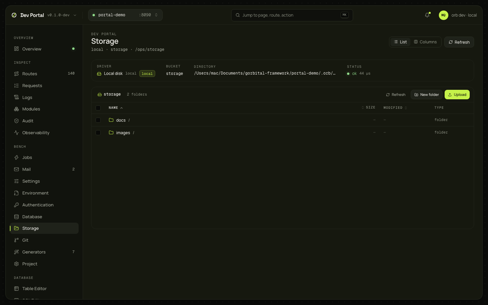

# Storage

The app's file storage: the driver and bucket with its status, a file browser with folders, upload, download, delete, move, new folder, previews, metadata and signed URLs, and a guard that keeps a bucket that isn't on this machine read-only until you unlock it. Reads `/ops/storage…`, so a Full app with storage (new Full apps have the local driver; `orb add storage` configures another).

## What you see

| Part | What it shows |
|---|---|
| Driver card | The driver (`Local disk` with a `local` badge, or the service), the bucket, the directory or the endpoint with its region, the status with its ping, the error when there is one, the public URL |
| Browser | Breadcrumbs with the folder count; Refresh, New folder, Upload; the selection's Download and Delete; a list view (name, size, modified, type; sortable, folders first; a checkbox and a menu per row; Load more) or a Finder-like column view, chosen with List or Columns in the header |
| Preview pane | The object inline (images; PDFs; text, JSON, CSV and Markdown up to 64 KiB) or metadata only; the key with copy, the size, content type, ETag, modification time and the metadata map; the actions |
| Guard banner | Red, when the store isn't local: "This is the spaces bucket acme-files — not on this machine", with Unlock for this session and Lock |

The folder (`?prefix=`) and the open object (`?key=`) live in the URL.

## What you can do

| Action | What it does | Confirmation |
|---|---|---|
| Upload | `PUT /ops/storage/object?key=` per file, with progress; drop files anywhere on the browser | No |
| Download | `GET /ops/storage/object/content?key=` | No |
| Delete | One `DELETE` per key; a folder deletes everything under it, markers included | Yes, with the count |
| Move or rename | `POST /ops/storage/object/move` | No |
| New folder | `POST /ops/storage/directories`: a hidden `<prefix>/.keep` marker, which listings hide | No |
| Signed URL | `POST /ops/storage/signed-url` for GET or PUT with an expiry (15 min, 1 h, 24 h, 7 d); Copy, Open, and a `curl` line for PUT | No |
| Unlock for this session | Makes a non-local bucket writable in this tab until Lock or the tab closes; remembered per bucket in `sessionStorage` | Yes |

Every write is audited: `storage.object.uploaded`, `storage.object.deleted`, `storage.object.moved`, `storage.directory.created`, `storage.signed_url.created`.

### The production guard

`GET /ops/storage` says whether the store is `local`. When it isn't (S3, Spaces, R2, MinIO), the page shows the red banner and disables Upload, New folder, Delete, Move and signed PUT URLs, because the same browser works against a production bucket on purpose. Unlock asks first and lasts for this tab's session. A local store is never locked.

## Where it comes from

`/ops/storage`, `/ops/storage/objects`, `/ops/storage/object`, `/ops/storage/object/content`, `/ops/storage/object/move`, `/ops/storage/directories`, `/ops/storage/signed-url` ([ops API](../guides/ops-api.md#storage)), as the development operator. Decided in [ADR-0075](../adr/0075-file-storage.md); the [storage guide](../guides/storage.md) has the drivers and the environment.

## Notes

- Uploads through `/ops/storage/object` are read into memory by the app, so its body limit applies; large files go through a signed PUT URL.
- Local signed URLs stop working when the app restarts without `STORAGE_SIGNING_KEY`.
- Keys are 1 to 1024 bytes, with no empty, `.` or `..` segment, no leading slash and no control characters; the dialogs refuse a bad key before sending.
- Above 32 MB the preview pane shows metadata only and offers the download.
- 404 `storage_off` shows a panel with `orb add storage`; 503 `storage_unavailable` shows the reason on the driver card.
