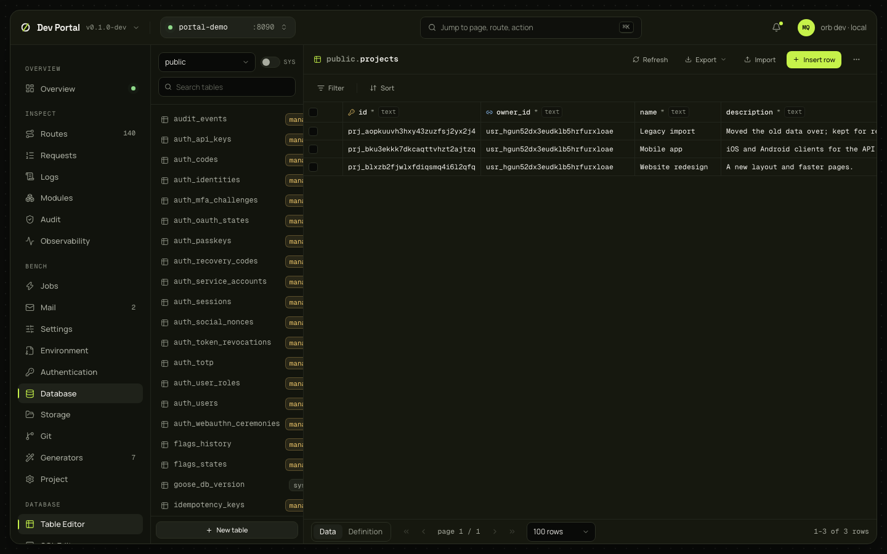

# Table Editor

Every table of every schema, its rows in a grid with filters, sorts and pages, editing by cell or by row, CSV import and export, and schema changes (a new table, a new or changed column, constraints) written as migrations you read before they are applied. Needs a database.

## What you see

| Part | What it shows |
|---|---|
| Sidebar | A schema dropdown (PostgreSQL's own schemas behind the SYS switch), search, every relation with a kind icon (table, view, materialized view, foreign table) and an ownership badge (`managed`, `system`), and New table |
| Toolbar | The table's name; Refresh, Export, Import, Insert row, and a menu with the table's changes |
| Grid | A sticky header with the type badge and the primary key, foreign key and unique icons per column, and a column menu; the rows as PostgreSQL prints them (`NULL` faint, `t`/`f`, `{a,"b c"}`, JSON, timestamps in UTC); a checkbox per row |
| Filter bar | Filter chips (`=`, `<>`, `>`, `<`, `>=`, `<=`, `like`, `ilike`, `in`, `is`) and sort chips (several columns, nulls first or last) |
| Footer | Data or Definition; the page, the page size (100, 500, 1,000) and the row count (`~` when estimated) |
| Definition | Columns, constraints, indexes, triggers, and a reconstructed `CREATE TABLE` |
| Banners | Why a table is read-only: no primary key, a view, a `system` table; a `managed` table's warning with an "allow edits" checkbox |

The selection, filters, sorts, page and view live in the URL (`?schema=&table=&filter=col:op:value&sort=col:desc&page=&limit=&view=`), so a view can be bookmarked.

Ownership comes from the catalog and name prefixes: `user` (the app's own; rows and schema editable), `managed` (a gorbital module's, such as `auth_*`; rows editable after the checkbox, schema not), `system` (`goose_db_version`, `river_*`, extensions; read-only).

## What you can do

### Rows

| Action | What it does | Confirmation |
|---|---|---|
| Edit a cell | Click, type, Enter (Escape cancels). A typed editor per kind: boolean, enum, JSON (validated), date and time, arrays; NULL and "default" as states. One `rows/update` by primary key with one value | No |
| Insert, duplicate, edit a row | A side sheet with every column | No |
| Delete | The selected rows, by primary key | Yes, naming the count |
| Import CSV | A file parsed in the browser: header row, column mapping, empty as NULL; sent in batches of 500; stops at the first refusal | No |
| Export | The current filters as CSV or JSON, paged by 1,000 | No |

Every value is sent as text for PostgreSQL to parse; a bad value comes back as 422 with the server's own message, where you typed it. An edit that would touch a different number of rows than expected is rolled back (409 `row_count`).

### Schema

| Action | Migration it plans |
|---|---|
| New table | `create_table`: columns, primary key, unique constraints, foreign keys, comment |
| Add a column | `add_column`: a type picker grouped by category with the app's enums, default suggestions (`now()`, `gen_random_uuid()`, literals), nullable, unique, identity, array, check |
| Edit a column | `alter_column`, plus `add_check` and `rename_column` when needed, planned and applied in order; a failure keeps what was applied |
| The column and table menus | `drop_column`, `add_foreign_key` (with `ON DELETE` and `ON UPDATE`, and a type check between the two columns), `add_unique`, `set_primary_key`, `rename_table`, `drop_table` |

Every schema change goes Preview then Apply. Preview shows the Up and Down SQL, the notes, an `irreversible` badge (drops lose data, and their Down is a comment) and the file's path. Apply writes `db/migrations/<version>_<name>.sql` and queues `migrate`; the page waits until the app reports it applied. A dirty git tree is refused unless "allow dirty" is ticked; managed and system tables are refused (403 `system_table`).

## Where it comes from

`GET /_portal/api/db/schemas`, `db/tables`, `db/tables/{schema}/{table}`, `db/types`; `POST db/rows/query`, `insert`, `import`, `update`, `delete`; `POST db/ddl/plan` and `apply` ([Dev Portal guide](../guides/dev-portal.md)). `orb dev` reads the database itself, with `DATABASE_URL` from `.env` (two connections, UTC, statement timeouts). Decided in [ADR-0067](../adr/0067-table-editor-and-pgmeta.md); the [database guide](../guides/database.md#migrations) has the migration rules.

## Notes

- Tables without a primary key are read-only (409 `no_primary_key`).
- The count is exact up to 100,000 rows and the planner's estimate beyond, or on a timeout.
- A migration the portal wrote and you then edit by hand is applied as edited; the portal never rewrites it.
- Row-level security isn't edited here: policies are written in migrations ([row-level security](../guides/row-level-security.md)).
- 503 `database_unavailable` when PostgreSQL doesn't answer; 404 `no_database` in a Minimal app.
